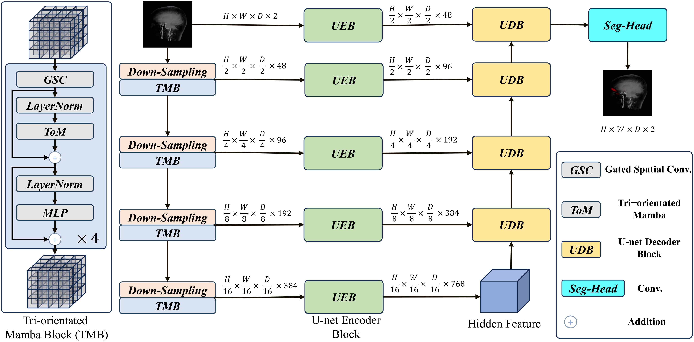
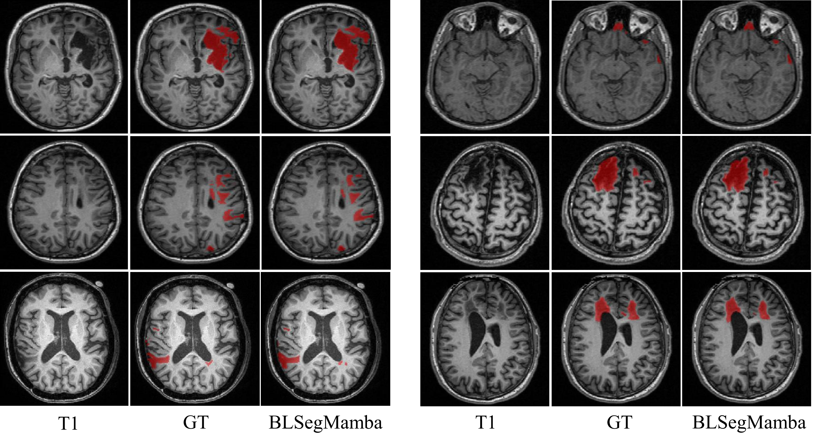
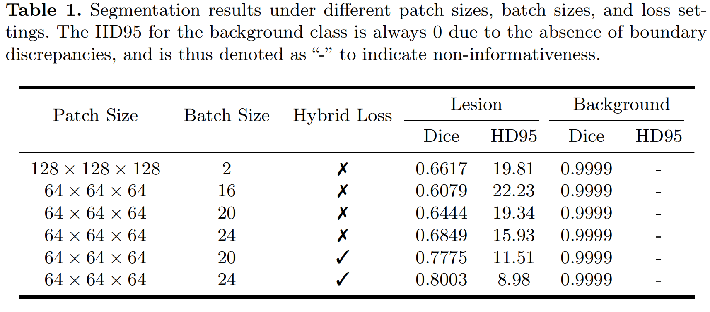

<div align="center">
  
# 🧩 BLSegMamba An Optimized SegMamba Framework for msTBI Lesion Segmentation in MRI

</div>
  
## The First Order Of Challenge AIMS-TBI 2025 


## The overall architecture of BLSegMamba



> Visual Results on AIMS-TBI 2025.



> Segmentation results under different patch sizes, batch sizes, and loss settings.



## ⚡ Data

### AIMS-TBI 2025

The data directory should be organized in the following manner.:

```text
data/
└── train_all_data/
    ├── scan_0001/
    │   ├── T1.nii.gz
    │   └── seg.nii.gz
    ├── scan_0004/
    │   └── ...
    ├── scan_0007/
    │   └── ...
    └── ...
```

## ⚡ Environment install

Creating a virtual environment in terminal: `conda create -n BLSegMamba python=3.10`

```bash
git clone https://github.com/YueyueZhu/BLSegMamba.git

cd BLSegMamba
```

### Install causal-conv1d

```bash
cd causal-conv1d

python setup.py install
```

### Install mamba

```bash
cd mamba

python setup.py install
```

### Install monai 

```bash
pip install monai
```

## ⚡ Preprocessing, training, and testing

### 🆓 Preprocessing
In my setting, the data directory of AIMS-TBI 2025 is : **./data/train_all_data/**.

First, we need to run the pre-processing code to do resample, normalization, and crop processes.

```bash
python 1_preprocessing_AIMSTBI_2025.py
```

### 🆓 Training 

When the pre-processing process is done, we can train our model.

The path of the test set list is: **./BLSegMamba/data/test_all_list_zero_one.py**.

We mainly use the pre-processde data from last step: **data_dir = ./data/train_all_fullres_process**


```bash 
python 2_train.py
```

### 🆓 Testing

When we have trained our models, we can inference all the data in testing set.

We provide the best checkpoint (optimal weights) at:  
**https://drive.google.com/file/d/1AkNn2iyJu-1GpajXaJ7IPFLgk3jDs52w/view?usp=drive_link**

We mainly use the pre-processde data from "Preprocessing" step: **data_dir = ./data/train_all_fullres_process/**.

And the parameter you get from last step: **model_path = ./data/parameter/best_model_AIMS_26.pth**.

```bash 
python 3_predict.py
```


